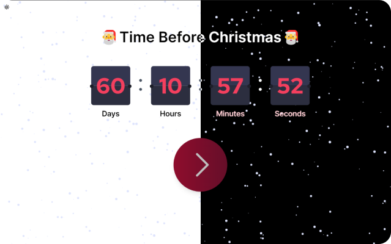

# 🌟 Christmas Meme Calendar - Next.js Project with Dark Mode 🎄

Ho, Ho, Ho! Welcome to the Christmas Meme Calendar, a delightful Next.js project that spreads joy and laughter during the holiday season, now with the added magic of Dark Mode. This project delivers daily memes to programmers and developers, making each day of December leading up to Christmas a bit more cheerful and amusing. Get ready to unwrap a new meme every day, with extra treats on the weekends, all while embracing the holiday spirit!



## 🚀 Features

- 📅 **Daily Memes**: Enjoy a fresh meme every day of December leading up to Christmas.
- 🌟 **Weekend Bonanza**: Double the fun with 2 memes every weekend.
- 🌒 **Dark Mode**: Toggle between light and dark mode to suit your preference.
- 🎉 **Randomization**: Memes are handpicked from our vast collection, ensuring a surprise every time you visit.
- 🖼️ **Interactive Interface**: A user-friendly and visually appealing Next.js application.
- 🎁 **Share the Joy**: Easily share your favorite memes with your colleagues and friends.
- 📱 **Responsive Design**: Works seamlessly on desktops, tablets, and mobile devices.
- 🕒 **Countdown**: Track the days until Christmas with our handy countdown timer.

## 🛠️ Technologies Used

- **Next.js**: A powerful React framework for building fast and efficient web applications.
- **Node.js**: For server-side scripting and handling API requests.
- **CSS Modules**: Scoped and modular CSS to keep styles organized.
- **Random Meme API**: We source memes from the internet's funniest corners.
- **Responsive Design**: Ensuring an excellent user experience across all devices.
- **Dark Mode Toggle**: Enhancing the user experience with Dark Mode support.
- **Git**: Version control for collaboration and code management.
- **E2E Testing**: Ensuring an perfect user experience across all browsers.

## 🏃‍♂️ Quick Start

1. **Clone the Repository**

```shell
git clone https://github.com/your-username/christmas-meme-calendar.git
cd christmas-meme-calendar
```

2. **Install Dependencies**

```shell
npm install
```

3. **Start the Development Server**

```shell
npm run dev
```

4. **Open Your Browser**
   Visit `http://localhost:3000` to see the Christmas Meme Calendar in action.

## 🎁 Contribute

We welcome contributions! Whether it's adding new memes, improving the user interface, or fixing bugs, your help is greatly appreciated. Check out our [contribution guidelines](CONTRIBUTING.md) to get started.

## 📃 License

This project is licensed under the [APACHE LICENSE, VERSION 2.0](LICENSE) except all the pictures.

## 🙏 Acknowledgments

A big thanks to all the meme creators and open-source community for making this project possible. Let's spread some holiday cheer together! For a demo look here [Demo](https://christmas-meme-calendar.vercel.app/)

## 📮 Contact

If you have any questions, suggestions, or just want to say hi, feel free to reach out to me at [philip.guldborg@miscgang.xyz](mailto:philip.guldborg@miscgang.xyz).

## 🌟 Spread the Joy

Share the Christmas Meme Calendar with your fellow programmers and developers and brighten up their holiday season! 🎉

[](https://twitter.com/intent/tweet?text=Check%20out%20the%20Christmas%20Meme%20Calendar%20%F0%9F%8E%84%20-%20A%20Next.js%20project%20that%20delivers%20daily%20memes%20for%20programmers%20and%20developers%20during%20the%20holiday%20season!%20%F0%9F%8E%85%20https%3A%2F%2Fgithub.com%2Fphiko-misc%2Fchristmas-meme-calendar)

Enjoy the laughter and Merry Christmas! 🎄🎁🌙
